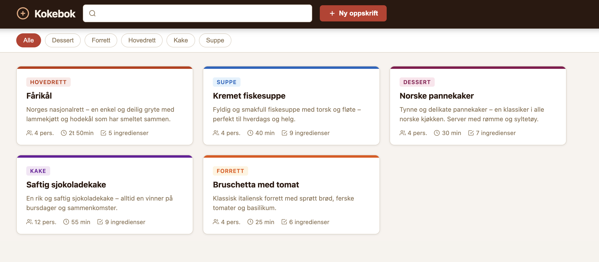
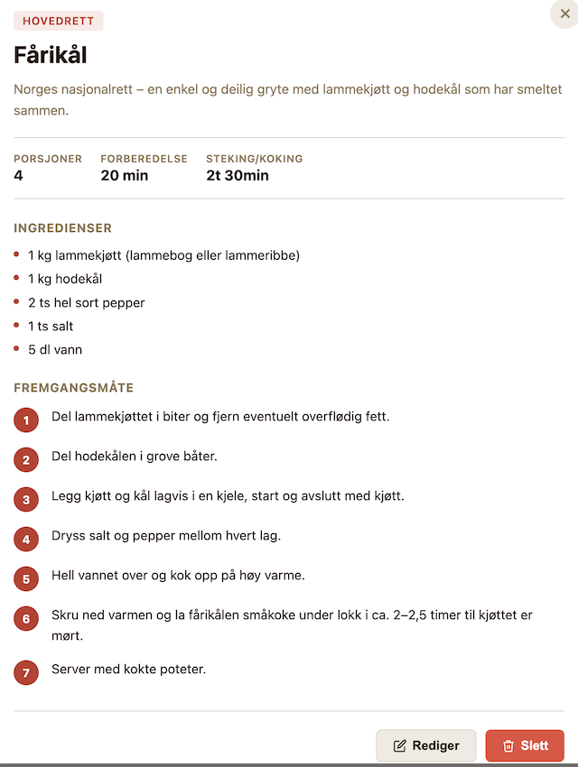

# Eksperimentlogg

Bruk denne filen til korte notater underveis i eksperimentet.

## Oppstart

- Dato: 2026-04-24
- Oppgave: Lag en kokebok web applikasjon 
- Handling: 
- Resultat: Front- og backend applikasjoner

---

- Gruppe: 2.2
- Tema: kokebok
- Eksperiment: Spesifiser den innledende prompten
- Dato: 2026-04-24
- Deltakere: Jan-Erik, Steinar og Espen S
- Verktøy/modeller: Claude
- Repo / case:

---

## Løpende logg

### Oppføring

- Tidspunkt: 13:45
- Hva ble testet: Enkel prompt: "lag en web applikasjon for vedlikhold av matoppskrifter"
- Betingelse / variant: Claude bestemmer rammeverk, database, oppskriftstruktur og fubksjoalitet
- Resultat / observasjon:
  Her er hva som ble bygget:

  Backend (Spring Boot / Java 23)
    - Recipe-entitet med tittel, beskrivelse, kategori, porsjoner, tilberedningstid, ingredienser (ordnet liste) og fremgangsmåte (ordnet liste)
    - REST API: GET/POST /api/recipes, GET/PUT/DELETE /api/recipes/{id}, GET /api/recipes/categories
    - H2-database lagret til fil (cookbook-data) — data overlever omstart
    - 5 eksempeloppskrifter forhåndslastet (Fårikål, Fiskesuppe, Pannekaker, Sjokoladekake, Bruschetta)

  Frontend (Vanilla HTML/CSS/JS)
    - Responisivt kortnett med fargekodede kategorier
    - Søk i sanntid (tittel + beskrivelse)
    - Kategorifitrering som pills i toppen
    - Detaljvisning med ingredienser og nummererte steg
    - Skjema for å legge til / redigere oppskrifter (dynamiske ingrediens- og stegrader)
    - Bekreftelsesdialog ved sletting
    - Escape-tast lukker modaler
  
      
  
      
- Måling / eksempel: 7m 57s · ↓ 33.8k tokens
- Tolkning / usikkerhet:

---

### Oppføring

- Tidspunkt: 15:40
- Hva ble testet: kjør inn prompten, i planned mode
- Betingelse / variant:
- Resultat / observasjon:
- Måling / eksempel:
- Tolkning / usikkerhet:

- Tidspunkt: 15:40
- Hva ble testet: spesifiser TDD apprach, tester for all kode
- Betingelse / variant: planned
- Resultat / observasjon:
- Måling / eksempel:
- Tolkning / usikkerhet:

- Tidspunkt: 16:25
- Hva ble testet: App ferdig ✻ Baked for 23m 31s
- Betingelse / variant: planned
- Resultat / observasjon: Det var mange trivielle spørsmål underveis
- Måling / eksempel:
- Tolkning / usikkerhet:

Summary Table

Tidspunkt: 16:25
- Hva ble testet: Ba claude om å evaluere appen
- Betingelse / variant: planned
┌───────────────────────────────┬───────┬────────────────────────────────────────────────────────┐
│           Severity            │ Count │                       Top items                        │
├───────────────────────────────┼───────┼────────────────────────────────────────────────────────┤
│ Critical (security/data loss) │ 6     │ Credentials in config, path traversal, ddl-auto=update │
├───────────────────────────────┼───────┼────────────────────────────────────────────────────────┤
│ High (correctness bugs)       │ 8     │ Missing @Valid, bad enum handling, index-as-key        │
├───────────────────────────────┼───────┼────────────────────────────────────────────────────────┤
│ Medium (robustness/perf)      │ 8     │ N+1 queries, no debounce, silent failures              │
├───────────────────────────────┼───────┼────────────────────────────────────────────────────────┤
│ Low (style/minor)             │ 5     │ CORS headers, broken image fallback                    │
└───────────────────────────────┴───────┴────────────────────────────────────────────────────────┘
